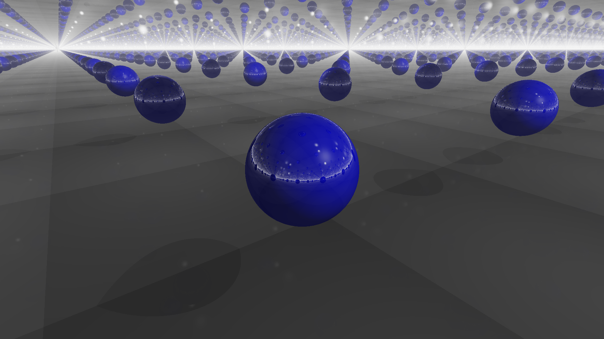
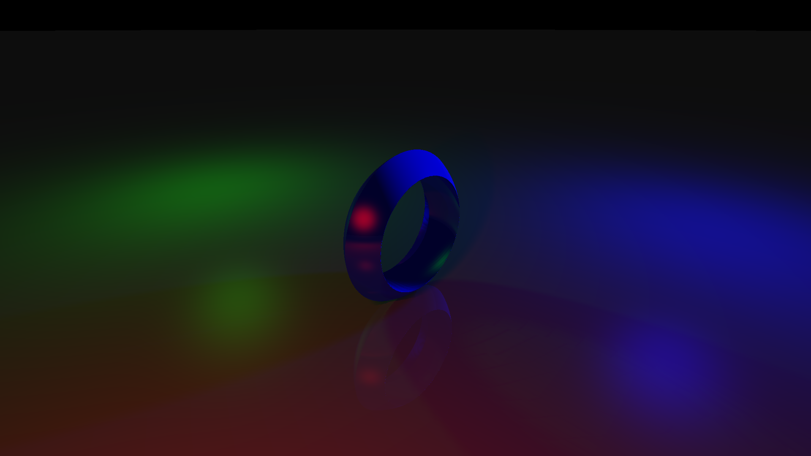

# Signed Distance Field Renderer (SDRenderer)

A rendering engine that renders signed distance fields with different materials and lighting.

---

## Render Showcase:

Mirror Room

Mirror Room (with a mirror floor)

Loop Flythrough

RGB Lights

Spinny RGB Lights (featuring compression artifacts)

Yellow Balls (Watch until the end!)

