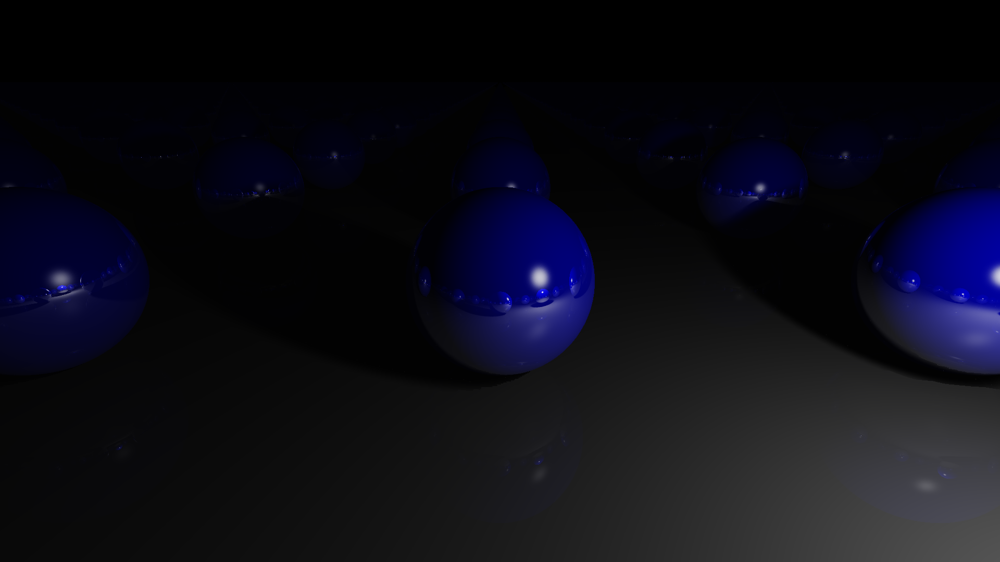

# Signed Distance Field Renderer (SDRenderer)

A rendering engine that renders signed distance fields with different materials and lighting.

 

## Usage Guide

1. Create `SDScene` with scene elements
   * Create `Lighting` object (using `IBackground` and various `ILight`)
     * There are different types of backgrounds and lights to choose from
   * Create one or many `SDObject` objects
     * Various methods such as `SDObject.Intersect` and `SDObject.RepeatXYZ` can be used to create complex objects
   * Add `Material` to each `SDObject` for shading
   * Create a `Camera` with specified screen dimensions
   * Adjust the camera's position and rotation to desired values
     * The `Camera.LookAt` can help you easily look at a certain point in space
2. Create a `Renderer` object using the `SDScene`
3. Render an `Image` using the `Renderer.Render` method 

### Tips

* If the scene is washed out or too dark, you can either change the brightness of the lights or adjust the global exposure setting
  * `RenderConfig.Exposure = 1f;` is the default
* You can change the maximum amount of reflections
  * `RenderConfig.MaxReflections = 2;` is the default
* If shadows look messed up, make sure the softness value for each light isn't too high
  * Values of `0f` to `0.4f` work the best

 

### 
Example Image

